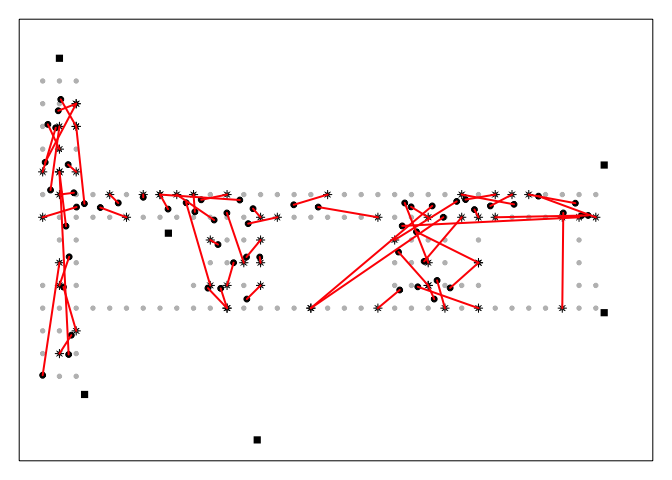

# CaseStudyUnit6
Jean Jecha, Manjula Kottegoda, Sharon Teo, Jessica Wheeler  
October 16, 2017  


#Introduction
Real Time Location System (RTLS) technique is used to determine relative or exact locations of a sensor at a given time. This case study involves Real Time Location System (RTLS) data collect from CRAWDAD <https://www.crawdad.org/> that originated in a University of Mannheim (See Figure 1) for Floor plan of the readings. 


The data used in the case study consists of two datasets that are named ‘offline’ and ‘online’. ‘Offline’ data is used for training the models and is collected from of 166 points spaced 1 meter apart in the hallway of the floor plan (grey circles in image above.) The ‘online’ data is for testing and predicting and are collected from 60 location from the same floor (black circles in image above.)

In this case study we will be using a statistical method known as the k-nearest neighbor to estimate the location of a device from the strength of the signal detected between the device and serveral access points. Our dataset contains training data where the signal is measured to several access points from known positions throughout the building. When we get new observations from an unknown location, we find the observation from our training data that is closest to this new observation. This method allows us to predict the position of the new observation.

The variables in the dataset are t for timestamp in milliseconds, id for MAC address of scanning device, pos for the physical coordinate of the scanning device, degree for orientation of the user carrying the scanning device in degrees and finally, MAC for the MAC address of a corresponding peer.

In this case study we will be using a statistical method known as the k-nearest neighbor to estimate the location of a device from the strength of the signal detected between the device and serveral access points. Our dataset contains training data where the signal is measured to several access points from known positions throughout the building. When we get new observations from an unknown location, we find the observation from our training data that is closest to this new observation. This method allows us to predict the position of the new observation.

The variables in the dataset are t for timestamp in milliseconds, id for MAC address of scanning device, pos for the physical coordinate of the scanning device, degree for orientation of the user carrying the scanning device in degrees and finally, MAC for the MAC address of a corresponding peer.

#Raw Data Processing

Read in the data as a string character vector called 'txt'. Then search for lines that start with a hashtag

```r
options(digits = 2)

txt = readLines("http://rdatasciencecases.org/Data/offline.final.trace.txt")
sum(substr(txt, 1, 1) == "#")
```

```
## [1] 5312
```


```r
length(txt)
```

```
## [1] 151392
```

There are 5,312 comment lines that start with a hashtag. Next we look at the number of lines in the file. There are 151,392 lines in the file. According to the documentation we expect there to be 146,080 lines. The defference between 151,392 and 146,080 is 5,312, which is what we expected


Next, we are going to manipulate the data. Notice how the main data elements are seperated by a semicolon.  Let's see how the semicolon splits the fourth line, which is the first line that is not a comment

```r
strsplit(txt[4], ";")[[1]]
```

```
##  [1] "t=1139643118358"                   
##  [2] "id=00:02:2D:21:0F:33"              
##  [3] "pos=0.0,0.0,0.0"                   
##  [4] "degree=0.0"                        
##  [5] "00:14:bf:b1:97:8a=-38,2437000000,3"
##  [6] "00:14:bf:b1:97:90=-56,2427000000,3"
##  [7] "00:0f:a3:39:e1:c0=-53,2462000000,3"
##  [8] "00:14:bf:b1:97:8d=-65,2442000000,3"
##  [9] "00:14:bf:b1:97:81=-65,2422000000,3"
## [10] "00:14:bf:3b:c7:c6=-66,2432000000,3"
## [11] "00:0f:a3:39:dd:cd=-75,2412000000,3"
## [12] "00:0f:a3:39:e0:4b=-78,2462000000,3"
## [13] "00:0f:a3:39:e2:10=-87,2437000000,3"
## [14] "02:64:fb:68:52:e6=-88,2447000000,1"
## [15] "02:00:42:55:31:00=-84,2457000000,1"
```
We can also split the character vector by a ';', '=' or ',' character and define the vector as 'tokens'. The first 10 elements of tokens give information about the hand-held device:


```r
tokens = strsplit(txt[4], "[;=,]")[[1]]
tokens
```

```
##  [1] "t"                 "1139643118358"     "id"               
##  [4] "00:02:2D:21:0F:33" "pos"               "0.0"              
##  [7] "0.0"               "0.0"               "degree"           
## [10] "0.0"               "00:14:bf:b1:97:8a" "-38"              
## [13] "2437000000"        "3"                 "00:14:bf:b1:97:90"
## [16] "-56"               "2427000000"        "3"                
## [19] "00:0f:a3:39:e1:c0" "-53"               "2462000000"       
## [22] "3"                 "00:14:bf:b1:97:8d" "-65"              
## [25] "2442000000"        "3"                 "00:14:bf:b1:97:81"
## [28] "-65"               "2422000000"        "3"                
## [31] "00:14:bf:3b:c7:c6" "-66"               "2432000000"       
## [34] "3"                 "00:0f:a3:39:dd:cd" "-75"              
## [37] "2412000000"        "3"                 "00:0f:a3:39:e0:4b"
## [40] "-78"               "2462000000"        "3"                
## [43] "00:0f:a3:39:e2:10" "-87"               "2437000000"       
## [46] "3"                 "02:64:fb:68:52:e6" "-88"              
## [49] "2447000000"        "1"                 "02:00:42:55:31:00"
## [52] "-84"               "2457000000"        "1"
```

```r
tokens[1:10]
```

```
##  [1] "t"                 "1139643118358"     "id"               
##  [4] "00:02:2D:21:0F:33" "pos"               "0.0"              
##  [7] "0.0"               "0.0"               "degree"           
## [10] "0.0"
```

Then we can extract the values for the 2nd, 4th, 6-8th and 10th lines of the variables time, id, position and x,y,z orientation.


```r
tokens[c(2, 4, 6:8, 10)]
```

```
## [1] "1139643118358"     "00:02:2D:21:0F:33" "0.0"              
## [4] "0.0"               "0.0"               "0.0"
```
The remainng values in the split vector are the recorded signals within the observation

```r
tokens[ - ( 1:10 ) ]
```

```
##  [1] "00:14:bf:b1:97:8a" "-38"               "2437000000"       
##  [4] "3"                 "00:14:bf:b1:97:90" "-56"              
##  [7] "2427000000"        "3"                 "00:0f:a3:39:e1:c0"
## [10] "-53"               "2462000000"        "3"                
## [13] "00:14:bf:b1:97:8d" "-65"               "2442000000"       
## [16] "3"                 "00:14:bf:b1:97:81" "-65"              
## [19] "2422000000"        "3"                 "00:14:bf:3b:c7:c6"
## [22] "-66"               "2432000000"        "3"                
## [25] "00:0f:a3:39:dd:cd" "-75"               "2412000000"       
## [28] "3"                 "00:0f:a3:39:e0:4b" "-78"              
## [31] "2462000000"        "3"                 "00:0f:a3:39:e2:10"
## [34] "-87"               "2437000000"        "3"                
## [37] "02:64:fb:68:52:e6" "-88"               "2447000000"       
## [40] "1"                 "02:00:42:55:31:00" "-84"              
## [43] "2457000000"        "1"
```
The results above show a 4-column data frame that shows the MAC address, signal, channel, and device type. We can now build a 4-column matrix called "tmp" and then bind these columns with the values from the first 10 entries using the function cbind

```r
tmp = matrix(tokens[ - (1:10) ], ncol = 4, byrow = TRUE)
mat = cbind(matrix(tokens[c(2, 4, 6:8, 10)], nrow = nrow(tmp),
                   ncol = 6, byrow = TRUE), tmp)
```

```r
tmp
```

```
##       [,1]                [,2]  [,3]         [,4]
##  [1,] "00:14:bf:b1:97:8a" "-38" "2437000000" "3" 
##  [2,] "00:14:bf:b1:97:90" "-56" "2427000000" "3" 
##  [3,] "00:0f:a3:39:e1:c0" "-53" "2462000000" "3" 
##  [4,] "00:14:bf:b1:97:8d" "-65" "2442000000" "3" 
##  [5,] "00:14:bf:b1:97:81" "-65" "2422000000" "3" 
##  [6,] "00:14:bf:3b:c7:c6" "-66" "2432000000" "3" 
##  [7,] "00:0f:a3:39:dd:cd" "-75" "2412000000" "3" 
##  [8,] "00:0f:a3:39:e0:4b" "-78" "2462000000" "3" 
##  [9,] "00:0f:a3:39:e2:10" "-87" "2437000000" "3" 
## [10,] "02:64:fb:68:52:e6" "-88" "2447000000" "1" 
## [11,] "02:00:42:55:31:00" "-84" "2457000000" "1"
```
The information about the device, ie time, id, position and x,y,z orientation is now combined with the recorded signals, ie MAC address, signal, channel and device type

```r
mat
```

```
##       [,1]            [,2]                [,3]  [,4]  [,5]  [,6] 
##  [1,] "1139643118358" "00:02:2D:21:0F:33" "0.0" "0.0" "0.0" "0.0"
##  [2,] "1139643118358" "00:02:2D:21:0F:33" "0.0" "0.0" "0.0" "0.0"
##  [3,] "1139643118358" "00:02:2D:21:0F:33" "0.0" "0.0" "0.0" "0.0"
##  [4,] "1139643118358" "00:02:2D:21:0F:33" "0.0" "0.0" "0.0" "0.0"
##  [5,] "1139643118358" "00:02:2D:21:0F:33" "0.0" "0.0" "0.0" "0.0"
##  [6,] "1139643118358" "00:02:2D:21:0F:33" "0.0" "0.0" "0.0" "0.0"
##  [7,] "1139643118358" "00:02:2D:21:0F:33" "0.0" "0.0" "0.0" "0.0"
##  [8,] "1139643118358" "00:02:2D:21:0F:33" "0.0" "0.0" "0.0" "0.0"
##  [9,] "1139643118358" "00:02:2D:21:0F:33" "0.0" "0.0" "0.0" "0.0"
## [10,] "1139643118358" "00:02:2D:21:0F:33" "0.0" "0.0" "0.0" "0.0"
## [11,] "1139643118358" "00:02:2D:21:0F:33" "0.0" "0.0" "0.0" "0.0"
##       [,7]                [,8]  [,9]         [,10]
##  [1,] "00:14:bf:b1:97:8a" "-38" "2437000000" "3"  
##  [2,] "00:14:bf:b1:97:90" "-56" "2427000000" "3"  
##  [3,] "00:0f:a3:39:e1:c0" "-53" "2462000000" "3"  
##  [4,] "00:14:bf:b1:97:8d" "-65" "2442000000" "3"  
##  [5,] "00:14:bf:b1:97:81" "-65" "2422000000" "3"  
##  [6,] "00:14:bf:3b:c7:c6" "-66" "2432000000" "3"  
##  [7,] "00:0f:a3:39:dd:cd" "-75" "2412000000" "3"  
##  [8,] "00:0f:a3:39:e0:4b" "-78" "2462000000" "3"  
##  [9,] "00:0f:a3:39:e2:10" "-87" "2437000000" "3"  
## [10,] "02:64:fb:68:52:e6" "-88" "2447000000" "1"  
## [11,] "02:00:42:55:31:00" "-84" "2457000000" "1"
```
There should be 11 rows, one for each MAC address and 10 columns where the first 6 columns represent the information for the handheld device and the last 4 columns representing the recorded signals 

```r
dim(mat)
```

```
## [1] 11 10
```
Now we can create a function called "processLine" so we can repeat this operation for each row

```r
processLine = function(x) {
  tokens = strsplit(x, "[;=,]")[[1]]
  tmp = matrix(tokens[ - (1:10) ], ncol = 4, byrow = TRUE)
  cbind(matrix(tokens[c(2, 4, 6:8, 10)], nrow = nrow(tmp),
               ncol = 6, byrow = TRUE), tmp)
}
```
Let's apply our function to several lines using lapply. We start at the 4th line because the first three lines are comments and end on the 20th line. The result is a list of 17 matrices

```r
tmp = lapply(txt[4:20], processLine)
```
We use sapply to determine how many signals were detected at each point

```r
sapply(tmp, nrow)
```

```
##  [1] 11 10 10 11  9 10  9  9 10 11 11  9  9  9  8 10 14
```
To stack the matrices together we use the function do.call()


```r
offline = as.data.frame(do.call("rbind", tmp))
dim(offline)
```

```
## [1] 170  10
```

```r
lines = txt[ substr(txt, 1, 1) != "#" ]
tmp = lapply(lines, processLine) # This line generates the error
```

```
## Warning in matrix(tokens[c(2, 4, 6:8, 10)], nrow = nrow(tmp), ncol = 6, :
## data length exceeds size of matrix

## Warning in matrix(tokens[c(2, 4, 6:8, 10)], nrow = nrow(tmp), ncol = 6, :
## data length exceeds size of matrix

## Warning in matrix(tokens[c(2, 4, 6:8, 10)], nrow = nrow(tmp), ncol = 6, :
## data length exceeds size of matrix

## Warning in matrix(tokens[c(2, 4, 6:8, 10)], nrow = nrow(tmp), ncol = 6, :
## data length exceeds size of matrix

## Warning in matrix(tokens[c(2, 4, 6:8, 10)], nrow = nrow(tmp), ncol = 6, :
## data length exceeds size of matrix

## Warning in matrix(tokens[c(2, 4, 6:8, 10)], nrow = nrow(tmp), ncol = 6, :
## data length exceeds size of matrix
```
We get a warning message. We can trace the error by setting the option to handle errors

```r
options(error = recover, warn = 2)
```
The error is due to a missing signal value. This observation can be deleted to fix the error. We change our function to return NULL if the tokens vector only has 10 elements. Here is our revised function 


```r
processLine = function(x) {
  tokens = strsplit(x, "[;=,]")[[1]]
  
  if (length(tokens) == 10) 
    return(NULL)
 
  tmp = matrix(tokens[ - (1:10) ], , 4, byrow = TRUE)
  cbind(matrix(tokens[c(2, 4, 6:8, 10)], nrow(tmp), 6, 
               byrow = TRUE), tmp)
}

tmp = lapply(lines, processLine)
offline = as.data.frame(do.call("rbind", tmp), 
                        stringsAsFactors = FALSE)

dim(offline)
```

```
## [1] 1181628      10
```
This time we do not get an error message and we have over one million rows and 10 columns

# Cleaning the Data
To clean the data we first create variables with meaningful names and convert them to the proper numeric data type


```r
names(offline) = c("time", "scanMac", "posX", "posY", "posZ", "orientation", "mac", "signal", "channel", "type")


numVars = c("time", "posX", "posY", "posZ", 
            "orientation", "signal")

offline[ numVars ] =  lapply(offline[ numVars ], as.numeric)  # idempotent
offline = offline[ offline$type == "3", ]                     # idempotent
offline = offline[ , "type" != names(offline) ]               # idempotent
dim(offline)
```

```
## [1] 978443      9
```

```r
offline$rawTime = offline$time
offline$time = offline$time/1000
class(offline$time) = c("POSIXt", "POSIXct")         # Use of "functional" assignment

unlist(lapply(offline, class))
```

```
##       time1       time2     scanMac        posX        posY        posZ 
##    "POSIXt"   "POSIXct" "character"   "numeric"   "numeric"   "numeric" 
## orientation         mac      signal     channel     rawTime 
##   "numeric" "character"   "numeric" "character"   "numeric"
```

```r
summary(offline[, numVars])
```

```
##       time                          posX         posY           posZ  
##  Min.   :2006-02-10 23:31:58   Min.   : 0   Min.   : 0.0   Min.   :0  
##  1st Qu.:2006-02-11 05:21:27   1st Qu.: 2   1st Qu.: 3.0   1st Qu.:0  
##  Median :2006-02-11 11:57:58   Median :12   Median : 6.0   Median :0  
##  Mean   :2006-02-16 06:57:37   Mean   :14   Mean   : 5.9   Mean   :0  
##  3rd Qu.:2006-02-19 06:52:40   3rd Qu.:23   3rd Qu.: 8.0   3rd Qu.:0  
##  Max.   :2006-03-09 12:41:10   Max.   :33   Max.   :13.0   Max.   :0  
##   orientation      signal   
##  Min.   :  0   Min.   :-99  
##  1st Qu.: 90   1st Qu.:-69  
##  Median :180   Median :-60  
##  Mean   :167   Mean   :-62  
##  3rd Qu.:270   3rd Qu.:-53  
##  Max.   :360   Max.   :-25
```

```r
summary(sapply(offline[ , c("mac", "channel", "scanMac")],
               as.factor))
```

```
##                 mac               channel                    scanMac      
##  00:0f:a3:39:e1:c0:145862   2462000000:189774   00:02:2D:21:0F:33:978443  
##  00:0f:a3:39:dd:cd:145619   2437000000:152124                             
##  00:14:bf:b1:97:8a:132962   2412000000:145619                             
##  00:14:bf:3b:c7:c6:126529   2432000000:126529                             
##  00:14:bf:b1:97:90:122315   2427000000:122315                             
##  00:14:bf:b1:97:8d:121325   2442000000:121325                             
##  (Other)          :183831   (Other)   :120757
```

```r
offline = offline[ , !(names(offline) %in% c("scanMac", "posZ"))]  # Get rid of two columns

# Exploring Orientation
length(unique(offline$orientation))
```

```
## [1] 203
```

```r
plot(ecdf(offline$orientation))
```

<!-- -->
The experiment was supposed to measure 8 orientations but the graph shows that this isn't the case. We should go ahead and round the orientation to the 8 equi-spaced angles. For example we will map an angle of 47.5 to 45 and 359.5 to 0 and so on. 

```r
pdf(file = "Geo_ECDFOrientation.pdf", width = 10, height = 7)
oldPar = par(mar = c(4, 4, 1, 1))
plot(ecdf(offline$orientation), pch = 19, cex = 0.3,
     xlim = c(-5, 365), axes = FALSE,
     xlab = "orientation", ylab = "Empirical CDF", main = "")
box()
axis(2)
axis(side = 1, at = seq(0, 360, by = 45))
par(oldPar)
dev.off()
```

```
## quartz_off_screen 
##                 2
```

```r
pdf(file = "Geo_DensityOrientation.pdf", width = 10, height = 5)
oldPar = par(mar = c(4, 4, 1, 1))
plot(density(offline$orientation, bw = 2), 
 xlab = "orientation", main = "")
par(oldPar)
dev.off()
```

```
## quartz_off_screen 
##                 2
```


```r
roundOrientation = function(angles){
  refs = seq(0, by = 45, length = 9)
  q = sapply(angles, function(o) which.min(abs(o - refs)))
  c(refs[1:8], 0)[q]
}

offline$angle = roundOrientation(offline$orientation)

with(offline, boxplot(orientation ~ angle,
                      xlab = "nearest 45 degrees angle",
                      ylab = "orientation"))
```

<!-- -->

The graph above shows that the new values have been rounded correctly to 0, 45, 90, 135, etc

#Exploring MAC Adresses


```r
c(length(unique(offline$mac)), length(unique(offline$channel)))
```

```
## [1] 12  8
```
We find that there are 12 MAC addresses adn 8 channels. 
```


```r
table(offline$mac)
```

```
## 
## 00:04:0e:5c:23:fc 00:0f:a3:39:dd:cd 00:0f:a3:39:e0:4b 00:0f:a3:39:e1:c0 
##               418            145619             43508            145862 
## 00:0f:a3:39:e2:10 00:14:bf:3b:c7:c6 00:14:bf:b1:97:81 00:14:bf:b1:97:8a 
##             19162            126529            120339            132962 
## 00:14:bf:b1:97:8d 00:14:bf:b1:97:90 00:30:bd:f8:7f:c5 00:e0:63:82:8b:a9 
##            121325            122315               301               103
```
Using the table function we are able to check the counts of observations for the various MAC addresses. We see that the counts for the first and the last 2 MAC addresses are very low. Furthermore the 3rd and 5th MAC address counts look low. This implies that these observations were not near the testing area or only working for a short time during the measurement process. We decide to keep the records for the top 7 devices. 


```r
subMacs = names(sort(table(offline$mac), decreasing = TRUE))[1:7] # Get the 7 most common mac addresses
offline = offline[ offline$mac %in% subMacs, ]
```
Finally we create a table of counts for the remaining MAC X Channel combinations and confirm that there is one non-zero entry in each row

```r
# establish that macChannel and mac are redundant
macChannel = with(offline, table(mac, channel))     

apply(macChannel, 1, function(x) sum(x > 0))
```

```
## 00:0f:a3:39:dd:cd 00:0f:a3:39:e1:c0 00:14:bf:3b:c7:c6 00:14:bf:b1:97:81 
##                 1                 1                 1                 1 
## 00:14:bf:b1:97:8a 00:14:bf:b1:97:8d 00:14:bf:b1:97:90 
##                 1                 1                 1
```
Indeed there is a one to one correspondence between the MAC address and channel for the 7 devices

```r
offline = offline[ , "channel" != names(offline)]
```
#Exploring the Position of the Hand-Held Device

In this section we look at the postion variables posX and posY and investigate how many locations actually have data. We use the by() function to tally up the number of rows in our data frame for each unique (x,y) combination


```r
xlocDF = with(offline, 
              by(offline, posX, function(x) x))  

locDF = with(offline, 
             by(offline, list(posX, posY), function(x) x))  # for each value X and Y, return the data frame that matches
                                                            # posX and posY have to be *factors*
                                                            # But note that it takes the cartesian product of posX x posY, creating nulls

length(locDF)
```

```
## [1] 476
```

```r
# since this is a list, use sapply
sum(sapply(locDF, is.null))
```

```
## [1] 310
```

```r
locDF = locDF[ !sapply(locDF, is.null) ]

length(locDF)
```

```
## [1] 166
```

```r
locCounts = sapply(locDF, nrow)
locCounts  #166
```

```
##   [1] 5505 5505 5506 5524 5543 5558 5503 5564 5513 5529 5526 5549 5526 5469
##  [15] 5464 5525 5429 5499 5532 5482 5396 5443 5358 5468 5447 5486 5483 5468
##  [29] 5444 5448 5503 5496 5472 5533 5459 5493 5543 5481 5539 5527 5490 5522
##  [43] 5433 5554 5463 5480 5409 5424 5526 5538 5442 5585 5556 5542 5526 5486
##  [57] 5560 5519 5507 5474 5447 5552 5500 5538 5365 5507 5409 5520 5551 5531
##  [71] 5615 5530 5517 5535 5474 5483 5541 5447 5506 5513 5519 5499 5576 5492
##  [85] 5473 5426 5529 5567 5528 5553 5595 5581 5519 5506 5437 5534 5536 5349
##  [99] 5331 5440 5448 5411 5470 5472 5671 5541 5514 5543 5452 5527 5543 5593
## [113] 5540 5531 5539 5621 5624 5495 5450 5500 5638 5586 5592 5619 5603 5626
## [127] 5477 5585 5588 5475 5559 5367 5461 5309 5330 5535 5395 5361 5494 5475
## [141] 5493 5481 5573 5527 5556 5504 5545 5553 5579 5692 5540 5492 5487 5589
## [155] 5463 5596 5557 5488 5523 5656 5524 5544 5734 5523 5553 5774
```

```r
# create a "map" of location counts
locCounts = sapply(locDF, 
                   function(df) 
                     c(df[1, c("posX", "posY")], count = nrow(df)))


class(locCounts)  # sapply created a matrix---why?
```

```
## [1] "matrix"
```

```r
dim(locCounts)
```

```
## [1]   3 166
```

```r
locCounts[ , 1:8]
```

```
##       [,1] [,2] [,3] [,4] [,5] [,6] [,7] [,8]
## posX  0    1    2    0    1    2    0    1   
## posY  0    0    0    1    1    1    2    2   
## count 5505 5505 5506 5524 5543 5558 5503 5564
```

```r
locCounts = t(locCounts)      # common occurence: transpose after running sapply

#pdf(file = "Geo_XYByCount.pdf", width = 10)
oldPar = par(mar = c(3.1, 3.1, 1, 1))
plot(locCounts, type = "n", xlab = "", ylab = "")     # first argument x, second y
text(locCounts, labels = locCounts[,3], cex = .8, srt = 45)
```

<!-- -->

```r
par(oldPar)
#dev.off()
```
The plot above shows the number of signals detected from all the access points. 110 signals were measured at 8 angles for each of the 6 access points for a total of 5280 recordings

Redo the preceding analysis in a concise function

```r
readData = 
  function(filename = 'http://rdatasciencecases.org/Data/offline.final.trace.txt', 
           subMacs = c("00:0f:a3:39:e1:c0", "00:0f:a3:39:dd:cd", "00:14:bf:b1:97:8a",
                       "00:14:bf:3b:c7:c6", "00:14:bf:b1:97:90", "00:14:bf:b1:97:8d",
                       "00:14:bf:b1:97:81"))
  {
    txt = readLines(filename)
    lines = txt[ substr(txt, 1, 1) != "#" ]
    tmp = lapply(lines, processLine)
    offline = as.data.frame(do.call("rbind", tmp), 
                            stringsAsFactors= FALSE) 
    
    names(offline) = c("time", "scanMac", 
                       "posX", "posY", "posZ", "orientation", 
                       "mac", "signal", "channel", "type")
    
     # keep only signals from access points
    offline = offline[ offline$type == "3", ]
    
    # drop scanMac, posZ, channel, and type - no info in them
    dropVars = c("scanMac", "posZ", "channel", "type")
    offline = offline[ , !( names(offline) %in% dropVars ) ]
    
    # drop more unwanted access points
    offline = offline[ offline$mac %in% subMacs, ]
    
    # convert numeric values
    numVars = c("time", "posX", "posY", "orientation", "signal")
    offline[ numVars ] = lapply(offline[ numVars ], as.numeric)

    # convert time to POSIX
    offline$rawTime = offline$time
    offline$time = offline$time/1000
    class(offline$time) = c("POSIXt", "POSIXct")
    
    # round orientations to nearest 45
    offline$angle = roundOrientation(offline$orientation)
      
    return(offline)
  }

offlineRedo = readData()

identical(offline, offlineRedo)
```

```
## [1] TRUE
```


# Signal Strength Analysis
## Distribution of Signal Strength


```r
library(lattice)

#pdf(file = "Geo_BoxplotSignalByMacAngle.pdf", width = 7)
oldPar = par(mar = c(3.1, 3, 1, 1))
bwplot(signal ~ factor(angle) | mac, data = offline,                 # Note how | indicates panels
       subset = posX == 2 & posY == 12 
                & mac != "00:0f:a3:39:dd:cd", 
       layout = c(2,3))
```

<!-- -->

```r
par(oldPar)
#dev.off()

summary(offline$signal)
```

```
##    Min. 1st Qu.  Median    Mean 3rd Qu.    Max. 
##     -98     -67     -59     -60     -53     -25
```

```r
#pdf(file = "Geo_DensitySignalByMacAngle.pdf", width = 8, height = 12)
oldPar = par(mar = c(3.1, 3, 1, 1))

densityplot( ~ signal | mac + factor(angle), data = offline,         # Note how | indicates panels with +
             subset = posX == 24 & posY == 4 & 
                         mac != "00:0f:a3:39:dd:cd",
             bw = 0.5, plot.points = FALSE)
```

<!-- -->

```r
par(oldPar)
```

```r
#offline = offline[ offline$mac != "00:0f:a3:39:dd:cd", ]

offline$posXY = paste(offline$posX, offline$posY, sep = "-")

byLocAngleAP = with(offline, 
                    by(offline, list(posXY, angle, mac), 
                       function(x) x))

signalSummary = 
  lapply(byLocAngleAP,            
         function(oneLoc) {
           ans = oneLoc[1, ]
           ans$medSignal = median(oneLoc$signal)
           ans$avgSignal = mean(oneLoc$signal)
           ans$num = length(oneLoc$signal)
           ans$sdSignal = sd(oneLoc$signal)
           ans$iqrSignal = IQR(oneLoc$signal)
           ans
           })

signalSummary[[1]]
```

```
##                  time posX posY orientation               mac signal
## 7 2006-02-10 23:31:58    0    0           0 00:0f:a3:39:dd:cd    -75
##   rawTime angle posXY medSignal avgSignal num sdSignal iqrSignal
## 7 1.1e+12     0   0-0       -67       -68 111      3.2       4.5
```

```r
offlineSummary = do.call("rbind", signalSummary)         #another common re-shuffle, rbind after lapply

# what does do.call do?
# "argument list" (cf. xargs in unix)
# called a Variadic Function
# example: List(1,2,3,...)


#pdf(file = "Geo_BoxplotSignalSDByAvg.pdf", width = 10)
oldPar = par(mar = c(3.1, 3, 1, 1))

breaks = seq(-90, -30, by = 5)
bwplot(sdSignal ~ cut(avgSignal, breaks = breaks),
       data = offlineSummary, 
       subset = mac != "00:0f:a3:39:dd:cd",
       xlab = "Mean Signal", ylab = "SD Signal")
```

<!-- -->

```r
                                                       # How to interpret this chart? "Distribution" of signal

par(oldPar)
#dev.off()

#pdf(file = "Geo_ScatterMean-Median.pdf", width = 10)
oldPar = par(mar = c(4.1, 4.1, 1, 1))

with(offlineSummary,
     smoothScatter((avgSignal - medSignal) ~ num,
                   xlab = "Number of Observations", 
                   ylab = "mean - median"))
abline(h = 0, col = "#984ea3", lwd = 2)

lo.obj = 
  with(offlineSummary,
       loess(diff ~ num, 
             data = data.frame(diff = (avgSignal - medSignal),
                               num = num)))

lo.obj.pr = predict(lo.obj, newdata = data.frame(num = (70:120)))
lines(x = 70:120, y = lo.obj.pr, col = "#4daf4a", lwd = 2)
```

<!-- -->

```r
par(oldPar)
#dev.off()
```

```r
oneAPAngle = subset(offlineSummary, 
                    mac == subMacs[5] & angle == 0)


library(fields)
```

```
## Loading required package: spam
```

```
## Loading required package: dotCall64
```

```
## Loading required package: grid
```

```
## Spam version 2.1-1 (2017-07-02) is loaded.
## Type 'help( Spam)' or 'demo( spam)' for a short introduction 
## and overview of this package.
## Help for individual functions is also obtained by adding the
## suffix '.spam' to the function name, e.g. 'help( chol.spam)'.
```

```
## 
## Attaching package: 'spam'
```

```
## The following objects are masked from 'package:base':
## 
##     backsolve, forwardsolve
```

```
## Loading required package: maps
```

```r
smoothSS = Tps(oneAPAngle[, c("posX","posY")], 
               oneAPAngle$avgSignal)

vizSmooth = predictSurface(smoothSS)

plot.surface(vizSmooth, type = "C")

points(oneAPAngle$posX, oneAPAngle$posY, pch=19, cex = 0.5)
```

<!-- -->

```r
surfaceSS = function(data, mac, angle = 45) {
  require(fields)
  oneAPAngle = data[ data$mac == mac & data$angle == angle, ]
  smoothSS = Tps(oneAPAngle[, c("posX","posY")], 
                 oneAPAngle$avgSignal)
  vizSmooth = predictSurface(smoothSS)
  plot.surface(vizSmooth, type = "C", 
               xlab = "", ylab = "", xaxt = "n", yaxt = "n")
  points(oneAPAngle$posX, oneAPAngle$posY, pch=19, cex = 0.5) 
}
parCur = par(mfrow = c(2,2), mar = rep(1, 4))

mapply(surfaceSS, mac = subMacs[ rep(c(5, 1), each = 2) ], 
       angle = rep(c(0, 135), 2),
       data = list(data = offlineSummary))
```

<!-- -->

```
## $`00:14:bf:b1:97:90`
## NULL
## 
## $`00:14:bf:b1:97:90`
## NULL
## 
## $`00:0f:a3:39:e1:c0`
## NULL
## 
## $`00:0f:a3:39:e1:c0`
## NULL
```

```r
par(parCur)
```
Looking at the heat maps from left to right, we can see that the heat map smears up. This indicates that when the device is facing the emitter, we get a strong signal strength. When facing away, the signal gets weaker and the heat map looks more blurry. We can make the conclusion that the angle that the reading is taken will affect the signal strength.


```r
offlineSummary = subset(offlineSummary, mac != subMacs[2])

AP = matrix( c( 7.5, 6.3, 2.5, -.8, 12.8, -2.8,  
                1, 14, 33.5, 9.3,  33.5, 2.8),
            ncol = 2, byrow = TRUE,
            dimnames = list(subMacs[ -2 ], c("x", "y") ))

AP
```

```
##                      x    y
## 00:0f:a3:39:e1:c0  7.5  6.3
## 00:14:bf:b1:97:8a  2.5 -0.8
## 00:14:bf:3b:c7:c6 12.8 -2.8
## 00:14:bf:b1:97:90  1.0 14.0
## 00:14:bf:b1:97:8d 33.5  9.3
## 00:14:bf:b1:97:81 33.5  2.8
```

```r
diffs = offlineSummary[ , c("posX", "posY")] - 
          AP[ offlineSummary$mac, ]

offlineSummary$dist = sqrt(diffs[ , 1]^2 + diffs[ , 2]^2) #Euclidean distance

xyplot(signal ~ dist | factor(mac) + factor(angle), 
       data = offlineSummary, pch = 19, cex = 0.3,
       xlab ="distance")
```

<!-- -->

```r
#pdf(file="Geo_ScatterSignalDist.pdf", width = 7, height = 10)
oldPar = par(mar = c(3.1, 3.1, 1, 1))
library(lattice)
xyplot(signal ~ dist | factor(mac) + factor(angle), 
       data = offlineSummary, pch = 19, cex = 0.3,
       xlab ="distance")
```

<!-- -->

```r
par(oldPar)
#dev.off()
```
As we look at the plots up and down, the angle changes and from left to right the location changes. We can see that as we get further from the emitter device we see a decrease in signal strength. In conclusion, the
plots show a rather obvious down-to-the-right signal strength. 

End of EDA
```

```r
macs = unique(offlineSummary$mac)
online = readData('http://rdatasciencecases.org/Data/online.final.trace.txt', subMacs = macs)

online$posXY = paste(online$posX, online$posY, sep = "-")

length(unique(online$posXY))
```

```
## [1] 60
```

```r
tabonlineXYA = table(online$posXY, online$angle)
tabonlineXYA[1:6, ]
```

```
##             
##                0  45  90 135 180 225 270 315
##   0-0.05       0   0   0 593   0   0   0   0
##   0.15-9.42    0   0 606   0   0   0   0   0
##   0.31-11.09   0   0   0   0   0 573   0   0
##   0.47-8.2   590   0   0   0   0   0   0   0
##   0.78-10.94 586   0   0   0   0   0   0   0
##   0.93-11.69   0   0   0   0 583   0   0   0
```


```r
keepVars = c("posXY", "posX","posY", "orientation", "angle")
byLoc = with(online, 
             by(online, list(posXY), 
                function(x) {
                  ans = x[1, keepVars]
                  avgSS = tapply(x$signal, x$mac, mean)
                  y = matrix(avgSS, nrow = 1, ncol = 6,
                        dimnames = list(ans$posXY, names(avgSS)))
                  cbind(ans, y)
                }))

onlineSummary = do.call("rbind", byLoc)  

dim(onlineSummary)
```

```
## [1] 60 11
```

```r
names(onlineSummary)
```

```
##  [1] "posXY"             "posX"              "posY"             
##  [4] "orientation"       "angle"             "00:0f:a3:39:e1:c0"
##  [7] "00:14:bf:3b:c7:c6" "00:14:bf:b1:97:81" "00:14:bf:b1:97:8a"
## [10] "00:14:bf:b1:97:8d" "00:14:bf:b1:97:90"
```

```r
m = 3; angleNewObs = 230
refs = seq(0, by = 45, length  = 8)
nearestAngle = roundOrientation(angleNewObs)
  
if (m %% 2 == 1) {
  angles = seq(-45 * (m - 1) /2, 45 * (m - 1) /2, length = m)
} else {
  m = m + 1
  angles = seq(-45 * (m - 1) /2, 45 * (m - 1) /2, length = m)
  if (sign(angleNewObs - nearestAngle) > -1) 
    angles = angles[ -1 ]
  else 
    angles = angles[ -m ]
}
angles = angles + nearestAngle
angles[angles < 0] = angles[ angles < 0 ] + 360
angles[angles > 360] = angles[ angles > 360 ] - 360

offlineSubset = 
  offlineSummary[ offlineSummary$angle %in% angles, ]

reshapeSS = function(data, varSignal = "signal", 
                     keepVars = c("posXY", "posX","posY")) {
  byLocation =
    with(data, by(data, list(posXY), 
                  function(x) {
                    ans = x[1, keepVars]
                    avgSS = tapply(x[ , varSignal ], x$mac, mean)
                    y = matrix(avgSS, nrow = 1, ncol = 6,
                               dimnames = list(ans$posXY,
                                               names(avgSS)))
                    cbind(ans, y)
                  }))

  newDataSS = do.call("rbind", byLocation)
  return(newDataSS)
}

trainSS = reshapeSS(offlineSubset, varSignal = "avgSignal")

selectTrain = function(angleNewObs, signals = NULL, m = 1){
  # m is the number of angles to keep between 1 and 5
  refs = seq(0, by = 45, length  = 8)
  nearestAngle = roundOrientation(angleNewObs)
  
  if (m %% 2 == 1) 
    angles = seq(-45 * (m - 1) /2, 45 * (m - 1) /2, length = m)
  else {
    m = m + 1
    angles = seq(-45 * (m - 1) /2, 45 * (m - 1) /2, length = m)
    if (sign(angleNewObs - nearestAngle) > -1) 
      angles = angles[ -1 ]
    else 
      angles = angles[ -m ]
  }
  angles = angles + nearestAngle
  angles[angles < 0] = angles[ angles < 0 ] + 360
  angles[angles > 360] = angles[ angles > 360 ] - 360
  angles = sort(angles) 
  
  offlineSubset = signals[ signals$angle %in% angles, ]
  reshapeSS(offlineSubset, varSignal = "avgSignal")
}

train130 = selectTrain(130, offlineSummary, m = 3)

head(train130)
```

```
##      posXY posX posY 00:0f:a3:39:e1:c0 00:14:bf:3b:c7:c6 00:14:bf:b1:97:81
## 0-0    0-0    0    0               -52               -66               -63
## 0-1    0-1    0    1               -53               -65               -64
## 0-10  0-10    0   10               -56               -66               -69
## 0-11  0-11    0   11               -55               -67               -70
## 0-12  0-12    0   12               -56               -70               -72
## 0-13  0-13    0   13               -55               -71               -73
##      00:14:bf:b1:97:8a 00:14:bf:b1:97:8d 00:14:bf:b1:97:90
## 0-0                -36               -64               -55
## 0-1                -39               -65               -59
## 0-10               -45               -67               -50
## 0-11               -48               -67               -55
## 0-12               -45               -67               -50
## 0-13               -43               -69               -54
```

```r
length(train130[[1]]) #Number of points that have data
```

```
## [1] 166
```
#Finding te Nearest Neighbors
We now have our training data that can be used to predict a new point. We create the findNN() function to find the locations in the training data that have signal strengths close to a test observation.

```r
findNN = function(newSignal, trainSubset) {
  diffs = apply(trainSubset[ , 4:9], 1, 
                function(x) x - newSignal)
  dists = apply(diffs, 2, function(x) sqrt(sum(x^2)) )
  closest = order(dists)
  return(trainSubset[closest, 1:3 ])
}
```
Now we can make our predictions for all of our test data using th predXY() function


```r
predXY = function(newSignals, newAngles, trainData, 
                  numAngles = 1, k = 3){
  
  closeXY = list(length = nrow(newSignals))
  
  for (i in 1:nrow(newSignals)) {
    trainSS = selectTrain(newAngles[i], trainData, m = numAngles)
    closeXY[[i]] = 
      findNN(newSignal = as.numeric(newSignals[i, ]), trainSS)
  }

  estXY = lapply(closeXY, 
                 function(x) sapply(x[ , 2:3], 
                                    function(x) mean(x[1:k])))
  estXY = do.call("rbind", estXY)
  return(estXY)
}
```
We first test our functions with 3 nearest neighbors and 1 nearest neighbors

```r
estXYk3 = predXY(newSignals = onlineSummary[ , 6:11], 
                 newAngles = onlineSummary[ , 4], 
                 offlineSummary, numAngles = 3, k = 3)

estXYk1 = predXY(newSignals = onlineSummary[ , 6:11], 
                 newAngles = onlineSummary[ , 4], 
                 offlineSummary, numAngles = 3, k = 1)

floorErrorMap = function(estXY, actualXY, trainPoints = NULL, AP = NULL){
  
    plot(0, 0, xlim = c(0, 35), ylim = c(-3, 15), type = "n",
         xlab = "", ylab = "", axes = FALSE)
    box()
    if ( !is.null(AP) ) points(AP, pch = 15)
    if ( !is.null(trainPoints) )
      points(trainPoints, pch = 19, col="grey", cex = 0.6)
    
    points(x = actualXY[, 1], y = actualXY[, 2], 
           pch = 19, cex = 0.8 )
    points(x = estXY[, 1], y = estXY[, 2], 
           pch = 8, cex = 0.8 )
    segments(x0 = estXY[, 1], y0 = estXY[, 2],
             x1 = actualXY[, 1], y1 = actualXY[ , 2],
             lwd = 2, col = "red")
}

trainPoints = offlineSummary[ offlineSummary$angle == 0 & 
                              offlineSummary$mac == "00:0f:a3:39:e1:c0" ,
                        c("posX", "posY")]

#pdf(file="GEO_FloorPlanK3Errors.pdf", width = 10, height = 7)
oldPar = par(mar = c(1, 1, 1, 1))
floorErrorMap(estXYk3, onlineSummary[ , c("posX","posY")], 
              trainPoints = trainPoints, AP = AP)
```

<!-- -->

```r
par(oldPar)
#dev.off()

#pdf(file="GEO_FloorPlanK1Errors.pdf", width = 10, height = 7)
oldPar = par(mar = c(1, 1, 1, 1))
floorErrorMap(estXYk1, onlineSummary[ , c("posX","posY")], 
              trainPoints = trainPoints, AP = AP)
```

<!-- -->

```r
par(oldPar)
#dev.off()
```

# Q12: Use k=2 and k=5
For this exercise we will predict location using a weighted average, where the weights are inversely proportional to the distance(in signal strength) from the test observation. We will use k=2 and k=5

#k=2

```r
estXYk2 = predXY(newSignals = onlineSummary[ , 6:11], 
                 newAngles = onlineSummary[ , 4], 
                 offlineSummary, numAngles = 3, k = 2)

oldPar = par(mar = c(1, 1, 1, 1))
floorErrorMap(estXYk2, onlineSummary[ , c("posX","posY")], 
              trainPoints = trainPoints, AP = AP)
```

<!-- -->

```r
par(oldPar)   
```
#k=5

```r
estXYk5 = predXY(newSignals = onlineSummary[ , 6:11], 
                 newAngles = onlineSummary[ , 4], 
                 offlineSummary, numAngles = 3, k = 5)

oldPar = par(mar = c(1, 1, 1, 1))
floorErrorMap(estXYk5, onlineSummary[ , c("posX","posY")], 
              trainPoints = trainPoints, AP = AP)
```

<!-- -->

```r
par(oldPar)         
```
We can find the sum of squared error with our calcError function


```r
calcError = 
function(estXY, actualXY) 
   sum( rowSums( (estXY - actualXY)^2) )

actualXY = onlineSummary[ , c("posX", "posY")]
sapply(list(estXYk1, estXYk3, estXYk2, estXYk5 ), calcError, actualXY)   
```

```
## [1] 659 307 372 276
```
#Q12 CalcError Analysis and Results
The calcError function shows that k=3 and k=5 nearest neighbor does the best job in predicting location due to having the smallest error compared to k=1 and k=2

```r
v = 11
permuteLocs = sample(unique(offlineSummary$posXY))
permuteLocs = matrix(permuteLocs, ncol = v, 
                     nrow = floor(length(permuteLocs)/v))
```

```
## Warning in matrix(permuteLocs, ncol = v, nrow = floor(length(permuteLocs)/
## v)): data length [166] is not a sub-multiple or multiple of the number of
## rows [15]
```

```r
onlineFold = subset(offlineSummary, posXY %in% permuteLocs[ , 1])

reshapeSS = function(data, varSignal = "signal", 
                     keepVars = c("posXY", "posX","posY"),
                     sampleAngle = FALSE, 
                     refs = seq(0, 315, by = 45)) {
  byLocation =
    with(data, by(data, list(posXY), 
                  function(x) {
                    if (sampleAngle) {
                      x = x[x$angle == sample(refs, size = 1), ]}
                    ans = x[1, keepVars]
                    avgSS = tapply(x[ , varSignal ], x$mac, mean)
                    y = matrix(avgSS, nrow = 1, ncol = 6,
                               dimnames = list(ans$posXY,
                                               names(avgSS)))
                    cbind(ans, y)
                  }))

  newDataSS = do.call("rbind", byLocation)
  return(newDataSS)
}

offline = offline[ offline$mac != "00:0f:a3:39:dd:cd", ]

keepVars = c("posXY", "posX","posY", "orientation", "angle")

onlineCVSummary = reshapeSS(offline, keepVars = keepVars, 
                            sampleAngle = TRUE)

onlineFold = subset(onlineCVSummary, 
                    posXY %in% permuteLocs[ , 1])

offlineFold = subset(offlineSummary,
                     posXY %in% permuteLocs[ , -1])

estFold = predXY(newSignals = onlineFold[ , 6:11], 
                 newAngles = onlineFold[ , 4], 
                 offlineFold, numAngles = 3, k = 3)

actualFold = onlineFold[ , c("posX", "posY")]
calcError(estFold, actualFold)
```

```
## [1] 197
```
k=5

```r
K = 20
err = rep(0, K)

for (j in 1:v) {
  onlineFold = subset(onlineCVSummary, 
                      posXY %in% permuteLocs[ , j])
  offlineFold = subset(offlineSummary,
                       posXY %in% permuteLocs[ , -j])
  actualFold = onlineFold[ , c("posX", "posY")]
  
  for (k in 1:K) {
    estFold = predXY(newSignals = onlineFold[ , 6:11],
                     newAngles = onlineFold[ , 4], 
                     offlineFold, numAngles = 3, k = k)
    err[k] = err[k] + calcError(estFold, actualFold)
  }
}

#pdf(file = "Geo_CVChoiceOfK.pdf", width = 10, height = 6)
oldPar = par(mar = c(4, 3, 1, 1))
plot(y = err, x = (1:K),  type = "l", lwd= 2,
     ylim = c(1200, 2100),
     xlab = "Number of Neighbors",
     ylab = "Sum of Square Errors")

rmseMin = min(err)
kMin = which(err == rmseMin)[1]
segments(x0 = 0, x1 = kMin, y0 = rmseMin, col = gray(0.4), 
         lty = 2, lwd = 2)
segments(x0 = kMin, x1 = kMin, y0 = 1100,  y1 = rmseMin, 
         col = grey(0.4), lty = 2, lwd = 2)

#mtext(kMin, side = 1, line = 1, at = kMin, col = grey(0.4))
text(x = kMin - 2, y = rmseMin + 40, 
     label = as.character(round(rmseMin)), col = grey(0.4))
```

<!-- -->

```r
par(oldPar)
#dev.off()

estXYk5 = predXY(newSignals = onlineSummary[ , 6:11], 
                 newAngles = onlineSummary[ , 4], 
                 offlineSummary, numAngles = 3, k = 5)

calcError(estXYk5, actualXY)
```

```
## [1] 276
```

```r
predXY = function(newSignals, newAngles, trainData, 
                  numAngles = 1, k = 3){
  
  closeXY = list(length = nrow(newSignals))
  
  for (i in 1:nrow(newSignals)) {
    trainSS = selectTrain(newAngles[i], trainData, m = numAngles)
    closeXY[[i]] = findNN(newSignal = as.numeric(newSignals[i, ]),
                           trainSS)
  }

  estXY = lapply(closeXY, function(x)
                            sapply(x[ , 2:3], 
                                    function(x) mean(x[1:k])))
  estXY = do.call("rbind", estXY)
  return(estXY)
}
```


